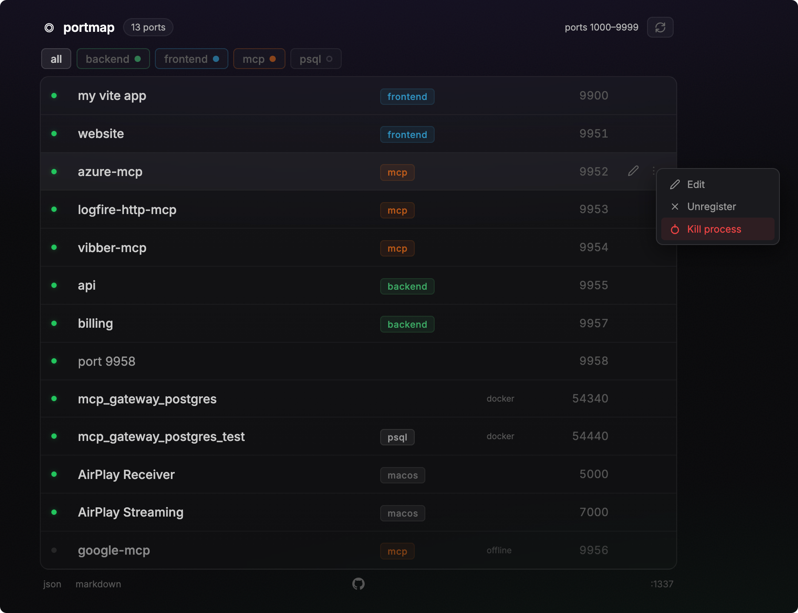

# portmap

> Map names to localhost ports. Made for agents and humans.

A lightweight alternative to [Vercel's Portless](https://github.com/vercel-labs/portless) — discover and manage what's running on your machine. Unlike Portless, portmap doesn't hijack your localhost with subdomain routing or break OAuth flows. It simply scans your ports, lets you name them, and gives you a clean dashboard + API. Agents can use the CLI, or `curl -H "Accept: text/markdown" http://localhost:1337` to get all the information and instructions they need.



## Install

### Homebrew (macOS & Linux)

```bash
brew install jonasks/tap/portmap
brew services start portmap          # start now + launch on login
```
Bookmark the dashboard at [localhost:1337](http://localhost:1337), or use the CLI:

```bash
❯ portmap list
ID     NAME                 PORT     CATEGORY     STATUS
2      app                  9900     frontend     up
3      vibe-frontend        9901     frontend     down
4      mcp-server           9951     mcp          up
5      email                9952     mcp          up
6      api                  9953     backend      up
7      billing              9954     backend      down
8      azure-mcp            9955     mcp          up
1      azure-fastapi        9958     backend      up
```

### From source

```bash
cargo install --path .
portmap install                      # start now + launch on login
```


## CLI

```bash
portmap serve                          # run in foreground (default)
portmap install                        # start on login (launchd/systemd)
portmap uninstall                      # stop service + remove db
portmap status                         # check if running
portmap list                           # show all ports (registered + open)
portmap add --name "my-app" -P 3000 -c frontend
portmap add -P 8080 -c backend         # tag a port without naming it
portmap remove 3000                    # remove by port or name
portmap update 3000 --name "new-name"  # update by port or name
portmap kill 3000                      # kill process on port (by port or name)
portmap --version
```

> **Homebrew users:** use `brew services start/stop portmap` instead of `portmap install/uninstall`.

## Features

- **Port scanning** — discovers all active localhost services (IPv4 + IPv6)
- **Live dashboard** — SSE-powered updates, no page reloads
- **Name & tag ports** — click to navigate, pencil icon or right-click to edit
- **Kill from dashboard** — right-click a row to kill the process or unregister it
- **Optional names** — tag a port with just a category, name is not required
- **Category badges** — tag services as frontend, backend, mcp, or anything
- **Custom tag colors** — right-click filter buttons to pick a color per category
- **Filter by tag** — quickly filter the dashboard
- **Agent-friendly** — `Accept: text/markdown` or `/markdown` returns clean markdown with full API docs
- **JSON API** — CRUD for registered apps at `/api/apps`, tag colors at `/api/tag-colors`
- **SQLite persistence** — survives restarts, stored at `~/.portmap.db`
- **Auto-migration** — DB schema upgrades automatically on new versions
- **Tiny binary** — single static binary, no runtime dependencies
- **Startup service** — `portmap install` registers launchd (macOS) or systemd (Linux)

## Claude Code skills

This repo is a [Claude Code plugin marketplace](https://docs.anthropic.com/en/docs/claude-code/skills) with two installable skills:

| Plugin | Description |
|--------|-------------|
| `portmap` | Teaches Claude to query and manage ports via the portmap API or CLI |
| `port-allocation` | Teaches Claude to pick an available port, document it, and register it when creating new services |

### Install as plugins

```
/plugin marketplace add JonasKs/portmap
/plugin install portmap@portmap
/plugin install port-allocation@portmap
```

Copy the skill files from [`skills/`](skills/) into your project's `.claude/skills/` directory and adapt to your conventions.

## License

MIT

## AI Use Disclaimer

This codebase has been built with a lot of support of AI. AI contributions welcome.
